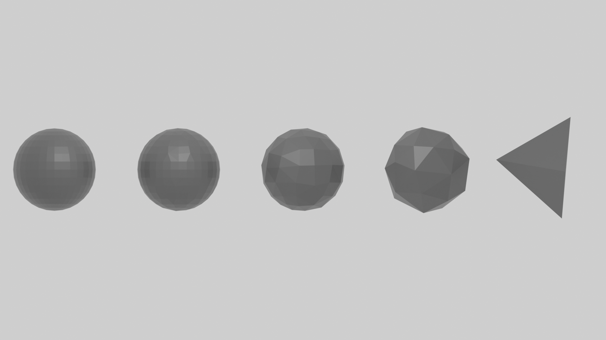
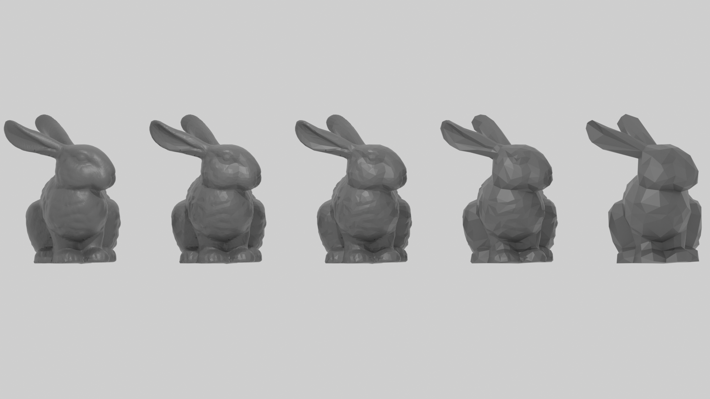

# Surface simplification 
## Project description
This is the repository for our project at the **Topological Data Analysis** course at the **Faculty of Computer and Information Science, University of Ljubljana**.

This code takes a triangulated surface and simplifies it by replacing edges with vertices in such a way that it causes the least amount of deformation. This algorithm was presented in the book [[1]](#1). More details on the algorithm and the implementation can be found in the report. **TODO: Add report**

You can see some results of our implementation in the following images. The first one represents the simplification of a sphere to the point where it becomes a tetrahedron. The second one represents the simplification of the "Stanford Bunny". The original model was taken from [The Stanford 3D Scanning Repository](https://graphics.stanford.edu/data/3Dscanrep/). Both images were rendered using Blender.

## Project structure
- `models/` contains models (surfaces) that are used as imput for the algorithm. They can be given in`.obj` or`.ply` format. Some basic models have been provided in the folder already. If you wish to add any of your own models, make sure that they are "nice" (they should be triangulated and preferably not contain holes).
- `output/` contains the output of the algorithm in form of`.obj` files.
- `renders/` contains some example renders that we have created using this algorithm. In addition to the ones displayed in this readme it also contains the simplifications of the "Stanford Bunny" at different resolutions.
- `Hasse.py` builds the *Hasse diagram* of the provided surface.
- `Homology.py` is used for computing homology of some provided surface.
- `main.y` is the entry point of the algorithm.
- `MinHeap.py` contains code for building a *MinHeap*.
- `Simplex.py` contains the *simplex* class.
- `Simplify.py` contains the code that simplifies a surface.

## Usage
1. Create a new Python virtual environment and install everything from `requirements.txt`.
2. In `main.py` specify the number of simplifications (variable `NUM_CONTRACTIONS`) and the path to your model (variable `path`).
3. Run the code using `python main.py`.
4. It will run for some time, depending on the complexity of the model, but the result should be visible in `output/` when it's finished.

### Homology computation
1. In `Homology.py`, specify the model path (variable `path`).
2. Run the code using `python Homology.py`.

## References
<a id="1">[1]</a>
*Computational topology: an introduction.* Edelsbrunner, Herbert and Harer, John L. 2022, American Mathematical Society.